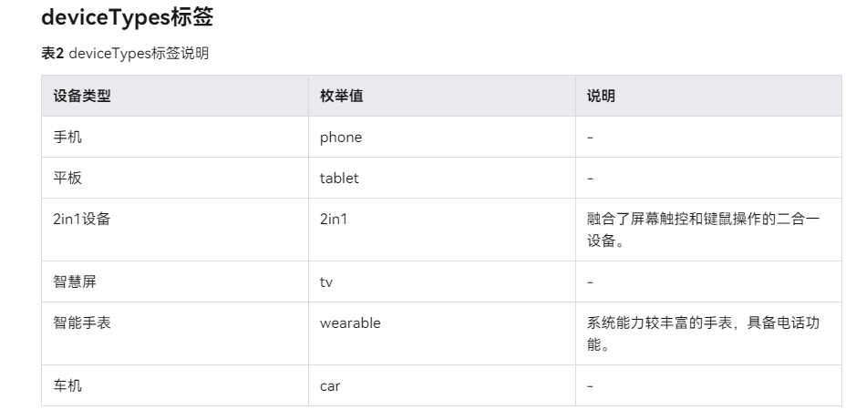

**当前适配版本为 5.0.0(12)**

## 环境
- [点击下载最新IDE](https://developer.huawei.com/consumer/cn/download/)
- DevEco Studio 5.0.1 Beta3
    - Build Version: 5.0.5.200, built on November 9, 2024
- Harmony OS Api 5.0.0(12)
- hvigor 5.0.0

### 工程目录

   ```
   commons                                         # 公共能力层，包括公共UI组件、数据管理、通信和工具库等
   |---network                                    // 网络相关 
   |---uicomponents                               // 公共组件相关
   |---utils                                      // 基础工具类、基础资源相关 
   features                                       # 基础特性层，包含独立的业务模块，如启动页、登录模块等              
   |---home                                       // 首页
   |   |---bean                                   // 数据模型
   |   |---components                             // 自定义组件
   |   |---constants                              // 常量
   |   |---model                                  // 业务模型
   |   |---service                                // 业务服务/接口
   |   |---views                                  // 视图层
   |   |---utils                                  // 此模块工具类 需要再加    
   |---login                                      // 登录
   |---question                                   // 问答
   |---scheme                                     // 体系
   |---mine                                       // 我的
   |---login                                      // 登录 
   libs                                           # 本地三方依赖库
   products                                       # 产品定制层，作为不同设备或场景应用入口，例如phone、tv等
   |---phone                                      // 手机
   |   |---app                                    // 全局初始化配置
   |   |---bean                                   // 数据模型
   |   |---components                             // 自定义组件 
   |   |---constants                              // 常量
   |   |---model                                  // 业务模型
   |   |---pages                                  // 页面 
   |   |---service                                // 业务服务/接口
   |   |---test                                   // 测试某个效果的例子
   ```

## 产品层目录参考



## 后期迭代各种APP分支规则,(全是仿照)
- 基于 master分支开发，APP都在**case**分支下
- 新建APP命名规则：case/APP名字。
- 目前分支：
 ```
  |---case/wanandroid    打造鸿蒙版玩安卓APP，参考项目：https://github.com/goweii/WanAndroid
  |---case/

 ```

## 开源协议

本项目基于 [Apache License](https://gitee.com/jiaojiaoone/explore-harmony-next/blob/master/LICENSE.txt) ，请自由地享受和参与开源。

## 源码

- gitee：https://gitee.com/jiaojiaoone/explore-harmony-next.git
- github：https://github.com/JasonYinH/ExploreHarmonyNext.git

## 博客地址

- csdn：https://blog.csdn.net/qq_40533422?type=blog
- juejin: https://juejin.cn/user/1151943919282350/posts

## 交流

使用有疑问或建议， **请提交issue（这样可以统一收集问题，方便更多人查阅，另外会也第一时间回复处理）** ，或者(+v: yinshiyuba)。
